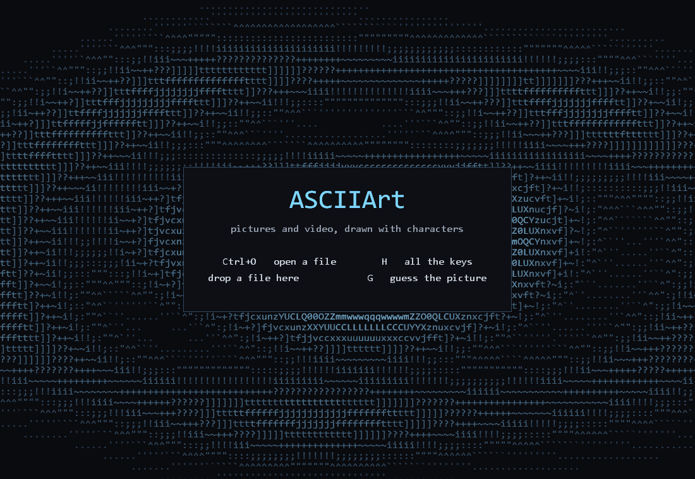
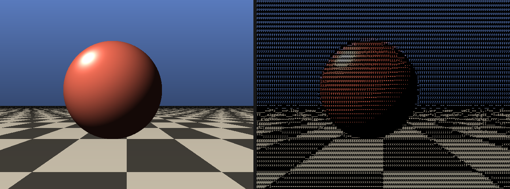
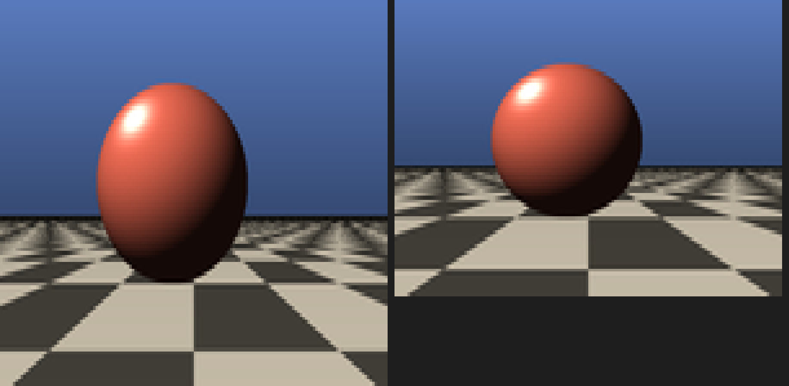
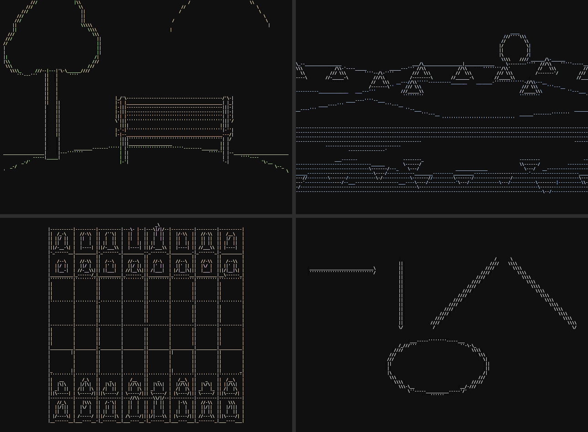

# ASCII art — a desktop app and a terminal viewer

Two front ends over the same renderer:

| | |
|---|---|
| **`asciiapp.exe`** | a native Windows app. Exact cell shape, zoom far past any terminal font, drag-and-drop, video playback. Build with `build.bat`. |
| **`asciiview.py`** | the terminal viewer. Same art, inside your shell. |

---

# asciiapp — the desktop app

```
build.bat                       needs gcc (MSYS2/MinGW) and ffmpeg on PATH
asciiapp.exe samples\sphere.png
asciiapp.exe samples\clip.mp4
```



Press **H** in the app for the key list. In short:

| key | |
|---|---|
| `+` `-` or wheel | zoom, 2–600 px cells |
| `M` | mode: ascii / line art / braille / blocks |
| `←` `→` | previous / next picture in the folder |
| `C` / `I` | colour or mono / invert |
| `[` `]` | brighter / darker midtones (line art: edge threshold) |
| `A` | mute / unmute video sound |
| `;` `'` | nudge the audio earlier / later |
| `L` | auto-levels on/off |
| `P` | slideshow, next picture every 4s |
| `F` | fullscreen |
| `Space`, `,` `.` | pause, seek -/+ 5s — or click the progress bar |
| `Ctrl+O` or `O` | open a file (drag-and-drop works too) |
| `S` | save as `<picture>-ascii.bmp` |
| `G` | guess-the-picture game |
| `0` | reset everything to defaults |
| `H` or `?` | show/hide the key list |
| `Q` or `Esc` | quit |

**Sound** comes from a second `ffplay` process rather than anything decoded
in the app. ffplay cannot be paused or seeked from outside, so pausing stops
it and resuming starts a fresh one at the current position; both it and the
video ffmpeg run off the wall clock, so they stay in step without a shared
timeline. It only starts when the file actually has an audio track. Every
child process is in a job object that dies with the app, so a crash or a
force-kill cannot leave music playing with no window to stop it.

Launching the two together is still not enough to line them up — ffplay's own
start-up latency left the sound about half a second behind the picture — so
the audio is started that much further into the file. The lead is a constant,
not drift, because both sides play in real time. It defaults to `+0.50s`, is
shown in the title bar, and `;` / `'` nudge it in 0.05s steps if your machine's
audio latency differs. `-av <seconds>` sets it from the command line.

**Seeking is debounced.** Each seek restarts both ffmpeg and ffplay, and the
old code also blocked the UI thread for ~160 ms waiting on the first frame of
the new position — so holding `,` or `.` queued one of those per press. Now
the target is noted and acted on once the keys go quiet, and the seek does not
wait for its first frame: the current picture stays up until the new ones
arrive.

**Monochrome** (`C`) uses each cell's own grey level, not white. In ascii and
braille either would look the same, because the glyph carries the brightness
— but `blocks` paints the cell with that colour directly, so white turned the
whole picture into a blank sheet.

**auto-levels** (`L`) stretches the darkest and brightest parts of the picture
out to the full range before rendering. Photographs rarely use the whole
range, and without it the glyph set only ever uses its middle, which makes
everything look flat. It is off for video, because re-levelling every frame
makes the picture pulse.

The title bar carries the live state: picture, grid, cell size, zoom level,
mode, colour/mono, inverted, auto-levels, midtone gamma, and for video the
elapsed and remaining time.

Starting it with no file shows a title screen, not a file dialog.

**Zoom steps by ratio, not by pixels.** The cell count is window ÷ cell, so a
fixed step of ±2 px feels right at 8 px and is useless at 300: halving the
grid went from 2 key presses to 150. Multiplying by 1.25 instead makes every
press worth the same — 3–4 presses to halve the grid anywhere, and 25 to
cross the whole range instead of 299.

**Guess the picture.** Press `G` and the image is drawn with a *single*
character. `Space` (or a click) reveals a bit more each time; whoever names it
first wins. It plays whatever is on screen, or picks one at random if nothing
is open. `N` jumps to another at random, `R` restarts, `Enter` gives up and
names it — the title bar hides the filename until then, since it would
otherwise be the answer.

Zoom is reported as a **level** from 1 to 100, where 100 is maximum zoom (a
single letter) and 1 is the full grid. It is logarithmic, because the column
count is geometric.

**Modes.** `ascii` matches glyph shapes to the image; `line art` draws only
edges, using the character that matches each edge's direction; `braille` uses
2×4 dithered dots (drawn, not from a font — Consolas has no braille);
`blocks` fills each cell with a solid colour. The terminal's `half` and `quad` modes
are deliberately *not* here: those exist only to work around a terminal cell
having one foreground and one background colour, which this app isn't subject
to — `blocks` is the equivalent and is strictly better.

**Start menu.** `install-shortcut.ps1` puts an "ASCIIArt" entry in the Start
menu so you can launch it by name:

```
powershell -ExecutionPolicy Bypass -File install-shortcut.ps1
```

**It declares itself DPI-aware.** Without that, Windows hands a scaled display
a smaller virtual client area and bitmap-stretches the result: the art is
blurry, there are fewer real pixels to put cells in (so it resolves *less*
than a DPI-aware terminal on the same screen), and the window's true edges sit
where the stretched image isn't — which is why the mouse could miss the close
button at the very corner.

**Why it exists.** Two problems with the terminal version go away here:

*The cell shape is chosen, not detected.* The app creates its font with an
explicit width **and** height, so a cell is exactly 1:2 and a circle is round
by construction. In a terminal the cell aspect has to be measured, and plenty
of terminals refuse to report it — at which point the picture comes out
stretched. Measured over the app's whole zoom range, a 400 px circle renders
to a bounding box within 0.3–2.7% of square (the residual is cell
quantisation, worst when cells are largest).

*Zoom keeps going.* Cells run from 48 px down to 4 px, well past the smallest
font a terminal will give you. Below 10 px a glyph's shape can't be seen
anyway, so it switches to a dithered tone ramp — which is also much faster.

Offscreen rendering is not limited by the screen at all:

```
asciiapp.exe in.png -o out.bmp -W 3840 -H 2160 -c 4     # 720x270 cells
asciiapp.exe in.png -o out.bmp -W 1600 -H 1200 -c 16 -m block
asciiapp.exe in.png -o bench.txt -W 1920 -H 1080 -c 12 -bench 25
```

Render cost at a 1920×1080 canvas:

Video is paced by ffmpeg's `-re` (it emits at the clip's own frame rate) and
the app takes whatever has accumulated in the pipe, keeping only the newest
frame. Deciding how many frames are "due" from a wall clock and reading that
many does not work: a pipe read blocks until ffmpeg produces the frame, so
skipping costs as much as drawing and playback slides into slow motion. Real
time is held to within 1-8% even when the renderer can only manage a fraction
of the frames.

**Rendering is threaded.** Cells are independent of one another and bands of
rows never share output pixels, so the cell loop, the resample and the clear
all split across cores with no locking. On 18 cores that is a 4–5x speedup,
and it is the difference between 8 fps and 40 fps at a 4K window:

| canvas | cells | before | after |
|---|---|---|---|
| 2560×1440, 16px | 263×90 | 35.1 ms | **10.3 ms** |
| 2560×1440, 10px | 421×144 | 72.1 ms | **17.6 ms** |
| 3840×2160, 12px | 526×180 | 121.8 ms | **25.0 ms** |
| 2560×1440, 4px | 1052×360 | 32.8 ms | **8.1 ms** |

The key list is composed into the back buffer and blitted with the frame.
Drawing it onto the window *after* the blit meant every video frame wiped and
redrew it, which read as a flicker.

Worth knowing: both glyph atlases have to be built before the bands start.
Leaving the braille atlas build inside the worker meant every thread raced to
free and rebuild it, which punched a black hole in the picture. Output is now
byte-identical across runs in every mode, which is the check that there is no
race left.

## Getting the most resolution out of it

The cell count is limited by window pixels, so press `F` for fullscreen and
`-` down to 4 px cells. What that gives you:

| window | 2px cells | 4px | 6px | 12px |
|---|---|---|---|---|
| 1500×830 | 1500×415 | 750×207 | 500×138 | 250×69 |
| 1920×1080 | 1920×540 | 960×270 | 640×180 | 320×90 |
| 2560×1440 | 2560×720 | 1280×360 | 853×240 | 426×120 |

Below about 4 px a "character" is a couple of pixels wide and this is really a
pixel renderer — but the option is there.

An offscreen render has no such limit — the canvas can be any size:

```
asciiapp.exe in.png -o out.bmp -W 3840 -H 2160 -c 4     # 1920x540 cells
```

## How the tone is worked out

Three things that all have to be right, or the picture comes out dark, harsh,
or both.

**Glyphs are rasterised supersampled.** Asking GDI for a 3 px font and hoping
for antialiasing does not work — it returns hard on/off pixels, which at small
cell sizes turns the art into harsh stripes and throws away every grey level.
The atlas is drawn 4–8× oversized and box-filtered down, so coverage is exact
at any cell size, right down to 2×4.

**Glyphs are composited in linear light.** Blending a glyph over its
background using the encoded byte values is the usual shortcut and it is
wrong: ink covering 35% of a cell should emit 35% of the *light*, but mixing
code values gives 35% of the code *value* — about a tenth of the light. Over a
picture made of thin strokes that is the difference between readable and
murky.

**Brightness is split between glyph and colour, then graded.** The densest
ASCII glyph inks only ~35% of its cell, so the brightest thing this medium can
emit on black is sRGB 156 — measured, not estimated. Coverage takes
`rel^0.75` and the colour carries `rel^0.25`, whose product is `rel`, so the
brightness is right without every colour being driven to white. A display
gamma (`-g`, default 0.62) then lifts the midtones into the range that
actually exists, the way you would grade a photo for a low-contrast medium.
`-g 1.0` gives the physically linear mapping, which measures correctly and
looks a stop and a half under-exposed.

---

# asciiview — pictures and video in the terminal

Shows images and plays videos as terminal art made of real characters, in
colour. Pure Python; needs only Pillow + numpy for images, and `ffmpeg` on
PATH for video.

```bash
python asciiview.py samples/sphere.png
python asciiview.py samples/clip.mp4
```



*Left: the source. Right: the terminal output, rasterised back to a PNG by
`verify.py` so it can be compared.*

## Modes

| `--mode` | How it draws | Use it for |
|---|---|---|
| `ascii` *(default)* | real characters, chosen by matching glyph **shape** to the cell | the classic look; plain-text export |
| `half` | `▀` with foreground = top pixel, background = bottom | photos and video, maximum fidelity |
| `quad` | Unicode quadrant blocks, 4 pixels split into 2 colour groups | sharp edges, graphics |
| `braille` | `⠿` 2×4 dots with ordered dithering | line art, maximum detail |

`half` and `quad` are coloured block glyphs — effectively small pixels, not
character art. They reproduce an image most accurately, but if you want the
thing that looks like ASCII art, that's `ascii`, which is the default.

Everything is geometry-correct: a circle comes out round, because the grid is
chosen so `cols / (rows × cell_aspect) == image_width / image_height`.

**The cell aspect is measured, not assumed.** Terminals with extra line
spacing have cells taller than the usual 2:1, and assuming 2.0 there stretches
the picture vertically — a sphere comes out as an egg, and the bigger the
render, the more obvious it gets. Detection tries, in order: the Win32
`GetCurrentConsoleFontEx` (the most dependable on Windows), `CSI 16 t`,
then `CSI 14 t` with `CSI 18 t`, then 2.0.

Not every terminal answers any of those. If yours doesn't, measure it:

```bash
python asciiview.py --probe     # what each method reports
python asciiview.py --square    # pick the block that looks square
python asciiview.py pic.png --cell-aspect 2.4
```

`--info` prints the value actually in use. If you keep hitting this, the
desktop app sidesteps it entirely — it sets the cell shape rather than
guessing at it.



*The same image on a terminal with 2.6:1 cells: assuming 2.0 (left) against
the measured value (right).*

## Common options

```bash
python asciiview.py pic.jpg --cols 120                 # pick a size
python asciiview.py pic.jpg --colors none              # plain monochrome
python asciiview.py pic.jpg --out art.txt              # save to a file
python asciiview.py pic.jpg --invert                   # for light terminals
python asciiview.py pic.jpg --mode half                # block mode instead
python asciiview.py clip.mp4 --status --loop           # stats line, repeat
python asciiview.py clip.mp4 --start 30 --duration 10  # play a section
python asciiview.py anim.gif                           # animated GIFs loop
python asciiview.py camera                             # live webcam
```

**Video is capped to 20000-ish cells by default** (`--max-cells`). Shape-matched
ascii samples 4x8 pixels per cell, so on a big terminal the grid alone decides
how much data ffmpeg has to push: at 877x329 cells that is a 3508x2632 frame,
831 MB/s, and playback simply stalls. Video therefore also defaults to
`--match density`, which samples 1x1 and buys about three times the cells for
the same effort — on a moving picture more cells beats better glyphs. Raise
the cap with `--max-cells 0` (no cap) if you would rather have the frames
dropped.

During playback: **q** or **Esc** quits, **space** pauses.

`--help` lists everything, including `--edge`, `--whiten`, `--match`,
`--gamma`, `--contrast`, `--fps`, `--chars` and `--colors {truecolor,256,16,none}`.

## Line art, and why it needs no model



Drawing with `-`, `|`, `/`, `\`, `_` means knowing which way each edge runs —
but that has a closed form, so there is nothing to learn. An edge lies
perpendicular to the image gradient, so a Sobel operator and one `atan2` give
the orientation exactly. Each cell bins its gradient magnitude into four
directions and takes the strongest; horizontal runs additionally pick `'`,
`-` or `_` depending on whether the edge sits high, middle or low in the
cell. A trained model would approximate a quantity we can compute outright,
more slowly.

What the technique does need is a **blur before the gradient**. Differentiating
raw pixels promotes every bit of noise — and every one-level step in a banded
gradient — to an "edge", and the picture fills with dashes. Smoothing first is
the standard opening move of edge detection, and it is the single change that
turned this from a mess into clean contours. `[` and `]` set how much edge
energy a cell needs before it inks anything.

## How the character mode works

Most terminal-art scripts pick a character by average brightness alone, out of
a hand-written ramp like `" .:-=+*#%@"`. That throws away the one thing
characters are good at — they have shapes — and the hand-written ramp's steps
are uneven, which flattens the midtones.

**Glyphs are measured, not guessed.** [`glyphs.py`](glyphs.py) rasterises every
printable character in your actual monospace font into a 4×8 coverage bitmap.
Each cell of the image is the same 4×8 patch of luminance, so the character
whose bitmap is closest to the patch is the right one. A diagonal edge becomes
`/`, a vertical one `|`, a flat bright patch `@` — all from one comparison,
with no edge detection anywhere.

**Tone and structure are scored separately.** Plain squared difference
punishes a glyph for concentrating its ink, so a flat mid-grey patch scores
worse against `|` than against a blank — and the midtones collapse to empty
space. Scoring average coverage and mean-removed pattern separately fixes it,
and `--edge` sets the balance. Cells with no internal contrast fall back to
tone alone instead of chasing noise.

**Nothing relies on a glyph filling its cell.** Flat areas are drawn as a
space in the background colour, not a full block in the foreground. The two
look identical when the font's block glyph fills its cell exactly — but a
terminal with extra line spacing draws the block short, and because a solid
block was assumed to hide the background, the untouched background showed
through as black scanlines across the picture. A space is always painted edge
to edge. `selftest.py` checks this by rasterising onto a simulated terminal
whose glyphs cover only 75% of the cell height.

**Colour hits a luminance target.** A cell's apparent brightness is its ink
coverage times its colour's brightness, so the colour has to make up whatever
the glyph's coverage doesn't supply. Scaling a peak-normalised colour doesn't
do that: a saturated hue carries little luminance to begin with (pure blue is
0.07), so a blue sky renders nearly black. `colorize()` solves for the
luminance instead, and `--whiten` controls how far saturated colours may wash
out towards white to reach a brightness glyphs can't otherwise hit.

## Checking it

`verify.py` parses the ANSI output back, redraws each cell the way a terminal
would (block glyphs geometrically, characters with a real font), and writes a
side-by-side PNG into `verify_out/`.

```bash
python verify.py samples/sphere.png --all
python selftest.py          # geometry, round-trip, ramp, tone, images, video
```

`selftest.py` passes 60/60 here. PSNR is the wrong yardstick for character art
— a glyph is the right glyph even though its ink lands in different pixels
than the source — so the real check is **tone correlation**: how well each
cell's on-screen brightness (chosen glyph's coverage × its colour's luminance)
tracks the original.

| check | result |
|---|---|
| tone correlation, test card | 0.991 |
| tone correlation, sphere render | 0.924 |
| tone correlation, UI screenshot | 0.916 |
| aspect ratio error, all modes | < 1.3% |
| ANSI round-trip, all 3 colour depths | exact, cell for cell |
| playback of a 30 fps clip | 29.8 fps, 0 dropped |
| flat field on a short-glyph terminal | 1 colour, 0% black (was 25% black) |
| cell-aspect probe parsing + fallbacks | exact |

Render cost at 160×45 cells (the terminal's own draw speed is usually the real
limit):

| mode | ms/frame | KB/frame |
|---|---|---|
| half | 2.5 | 71 |
| quad | 7.6 | 77 |
| braille | 10.9 | 70 |
| ascii | 19.1 | 40 |

## What it's good at, and what it isn't

Character art needs a subject whose structure survives being reduced to one
glyph per cell. The test card, the sphere render, the chessboard screenshot
and the test video all read clearly.

The forest photo in `samples/` is the weak case and is kept deliberately as
one. Its texture *within* each cell measures 0.083 against 0.045 for the
sphere, so noise competes with the large-scale shape and the result is closer
to a wall of text — tone correlation drops to 0.81. That's a property of the
subject, not a setting to fix: busy, low-contrast scenes don't make good
character art at any size. Use `--mode half` for those.

## Files

| | |
|---|---|
| `asciiapp.c` / `build.bat` | the desktop app: Win32 window, own glyph rasteriser, ffmpeg pipe |
| `asciiview.py` | the terminal CLI — images, GIFs, video, webcam |
| `asciiart.py` | the renderer: the four modes, colour model, ANSI encoding |
| `glyphs.py` | rasterises the font into the 4×8 glyph bank used for matching |
| `ramp.py` | measures glyph ink coverage for the `--match density` ramp |
| `term.py` | Windows VT mode, UTF-8 output, terminal size, key polling |
| `verify.py` | turns the ANSI back into a PNG and scores it |
| `selftest.py` | the whole battery |
| `samples/make_samples.py` | regenerates the samples |
| `Makefile` | `make`, `make run`, `make test`, `make samples`, `make clean` |
| `make_icon.py` | builds `asciiapp.ico` by running a letter 'A' through this renderer |
| `install-shortcut.ps1` | adds/removes the Start menu entry |

## Notes

- Needs a terminal with 24-bit colour. Windows Terminal, VS Code and most
  modern terminals qualify; `--colors 256` or `--colors 16` falls back.
- Audio plays through `ffplay` when it's on PATH; `--no-audio` turns it off.
  Pausing stops the picture but not the sound.
- Video uses the alternate screen, so your scrollback survives.
- The glyph bank and ramp are cached next to the code (`glyphbank.npz`,
  `ramp_cache.json`); delete them to rebuild against a different font.
- The cell aspect is detected automatically. If a terminal answers the query
  wrongly, or doesn't answer and isn't 2:1, set `--cell-aspect` by hand —
  `--info` shows the value in use.
